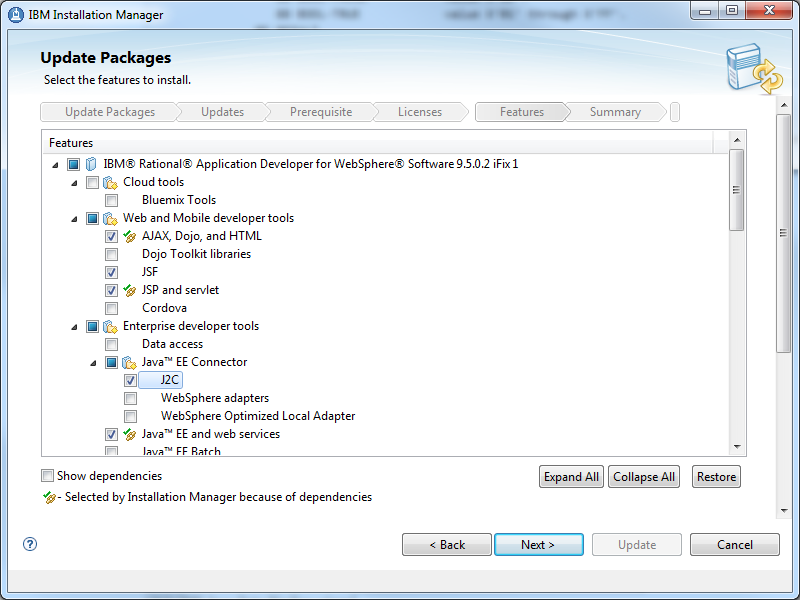
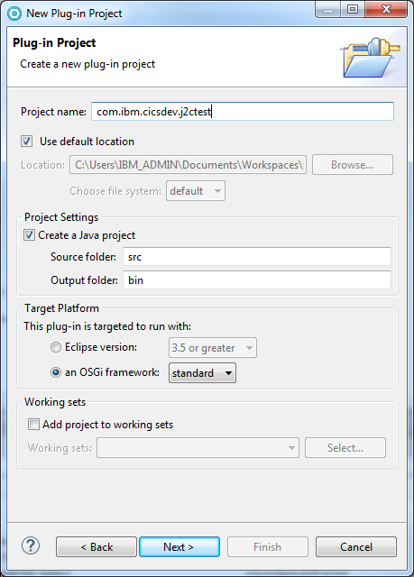
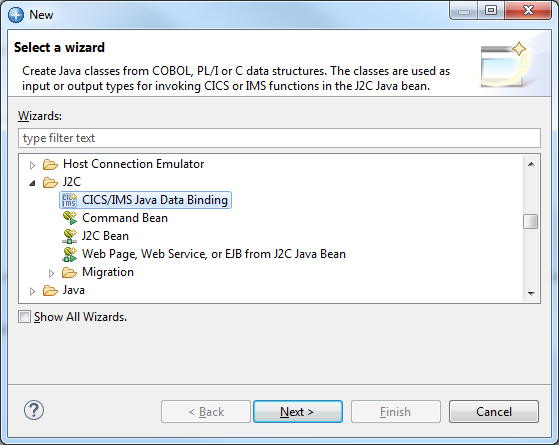
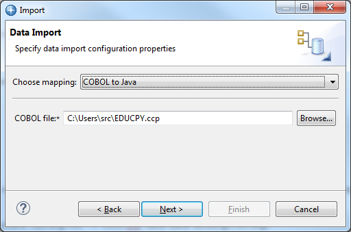
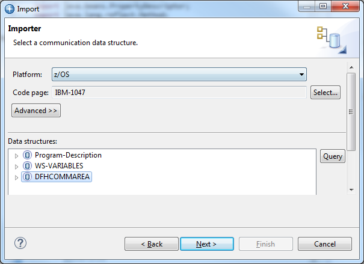
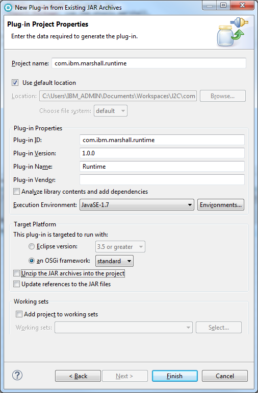

Generating Java Records from COBOL with Rational J2C Tools
==========================================================

Author: Phil Wakelin

*When developing a Java program to link to a CICS program with a
COMMAREA or access a VSAM file, you will typically need to map the
underlying record structure from a high level language copybook to Java
data types. This article describes how the Java Data Bindings in
Rational Application Developer for WebSphere Software
([RAD](http://www.ibm.com/software/products/en/application)) can be used
to create Java classes from COBOL data structures for use as input or
output types in a CICS Java program that interacts with record based
language structures.*

## J2C Java Data Bindings

The J2C tooling in RAD is provided through a set of wizards called the
*CICS and IMS Java Data Bindings*. They support the importing of data
structures from COBOL, PL/I and C source code in order to generate Java
classes with setter and getter methods for accessing the fields within
the records. As part of the generation process the encoding of character
and numeric data types can be specified to ensure that data conversion
is correctly performed when passing data from Java to the EBCDIC runtime
in CICS.

> **Note:** an alternative solution to J2C is to use the IBM Record
Generator for Java which supports COBOL and Assembler and is described
further in this tutorial [Building Java records from
COBOL with the IBM Record Generator for Java](blog.md).

The J2C tooling is now also available in IBM Developer for z/OS Enterprise Edition v14.
For more details, see [https://www.ibm.com/support/pages/node/713179](https://www.ibm.com/support/pages/node/713179).

In this tutorial we will show you how to perform the following steps:

1.  Install Rational Application Developer for WebSphere on your
    workstation, in this tutorial we used RAD v9.5.0.2
2.  Run the J2C record importer to generate a Java data binding class
    from a COBOL copybook
3.  Develop a CICS Java program to use the generated data binding class
    when linking to a CICS COBOL program and deploy this into a CICS
    OSGi JVM server

### 1. Installing RAD

Install Rational Application Developer using the IBM Installation
Manager. You will need to ensure that you install J2C feature during the
installation process, as this is not selected by default. It can be
found under the **Enterprise developer tools -\> Java EE Connector -\>
J2C** install option as shown below.



### 2. Running the J2C record importer

The first step in generating the record bean is to transfer the COBOL
copybook from z/OS to your workstation. We will use the sample copybook
EDUCPY which you can download from this CICSDev Git
[repository](https://github.com/cicsdev/cics-java-jzosprog). This sample
provides the following DFHCOMMAREA structure which includes the most
common types of COBOL data elements.

```cobol
       01   DFHCOMMAREA.
           03  DATA-PAYLOAD.
              05 BINARY-DIGIT            PIC 9(4)       COMP.
              05 CHARACTER-STRING        PIC X(30).
              05 NUMERIC-STRING          PIC 9(18).
              05 PACKED-DIGIT            PIC 9(15)      COMP-3.
              05 PACKED-DIGIT-WITH-COMMA PIC 9(12)V9(3) COMP-3.
              05 SIGNED-PACKED           PIC S9(12)     COMP-3.
              05 BOOL                    PIC X.
                 88 BOOL-FALSE           value X'00'.
                 88 BOOL-TRUE            value X'01' through X'FF'.
              05 RESULT.
                 09 RESULT-CODE          PIC S9(5)      VALUE +0.
                 09 RESULT-TEXT          PIC X(25).
```

> **Note:** the J2C COBOL importer requires that the imported structure
> is a fully formatted structure and so must start with a COBOL 01 level
> item.



#### 2.1 Creating a project

We will be using an OSGi development environment so before we generate
any code we will first need to create a new OSGi Plug-in project in
Eclipse using the wizard **File -\> New -\> Plug-in Development -\>
Plug-in Project** as shown on the right. As you go through the wizard
follow these steps:

1.  On the first panel of the Plug-in Project wizard, select the
    standard OSGi framework option as we do not need any extra Eclipse
    or Equinox extensions
2.  On the second panel, make sure that the Version is set to 1.0.0
    without a qualifier as the OSGi JVM server does not support the use
    of qualifiers. Also ensure the selected Java execution environment
    is supported in your JVM server and that the option to generate an
    activator is not selected as this is not required
3.  On the third panel uncheck the box to create a plug-in using a
    template as we will add our own application code to the project.

#### 2.2 Generating the J2C data binding

Having transferred the copybook to the workstation this can now be used
to create a J2C data binding class using the wizard **J2C -\> CICS/IMS
Java Data Binding** as shown below:



Click **Next** and then select **COBOL to Java** as this provides the
mapping we require, and then use the Browse dialog to navigate to your
COBOL source code on the workstation. Click **Next** when you have
completed this step.



Select the platform and code page which will be used by the COBOL
application. This will be used by the J2C data bindings at runtime when
accessing the fields in the data bindings and needs to correctly reflect
the encoding of the data used in the COBOL application. In our example
we select z/OS and the EBCDIC codepage of IBM-1047 which is the local
CCSID our CICS system will be using. In the *Data structures* section
select the 01 level COBOL data structure, in our example this is the
DFHCOMMAREA.



Click **Next** and then select the name of the Java project, package and
class for the generated code. In this example we used the following
convention.

- **Project**: com.ibm.cicsdev.j2ctest
- **Package**: com.ibm.cicsdev.bean
- **Class**: J2CCommareaWrapper


#### 2.3 Resolving package imports

In an OSGi development environment *Target Platform* definitions are
used to define the plugins that applications in the workspace will be
built against. The CICS Explorer SDK provides a set of sample Target
Platforms which provide the JCICS APIs for different CICS TS versions.
The Target Platform is set using the Eclipse menu **Windows -\>
Preferences -\> Plug-in Development -\> Target Platform**. Click **Add**
and then from the supplied templates select the CICS TS release for your
runtime environment, and click **Next** and then **Finish**. You can
then select this and apply this to your workspace.

[

Having created the CICS Target Platform, you may notice that your J2C
generated code does not have all the required interfaces available and
so will not compile in Eclipse. So we will need to add the J2C libraries
to our workspace to augment the Target Platform.

The JARs we will need to add to our Target Platform are marshall.jar
from RAD and connector.jar from the Java SDK on z/OS.

#### 2.3.1 Adding marshall.jar

First locate the redistributable marshall.jar from your Rational
Application Developer, this is usually located in the
`SDPShared\plugins\com.ibm.ccl.commonj.connector.metadata_nnn\runtime`
folder. Import into Eclipse using the wizard **New -\> Plugin from
Existing JAR archives** wizard as shown below, making sure you uncheck
the *Unzip the JAR archives into the project* as you do not need to
unpack the JAR as it only contains compiled classes. Select the
**standard** OSGi framework option, and make sure that the selected Java
execution environment is supported on your target CICS environment.
Lastly click **Finish** and the wizard will create the wrapper bundle.



Validate the bundle manifest for the wrapper bundle to ensure that the
required packages
`com.ibm.etools.marshall.util and com.ibm.etools.marshall` are exported.
The manifest can be found in at `META-INF/MANIFEST` and should be
similar to the example below.

```
    Manifest-Version: 1.0
    Bundle-ManifestVersion: 2
    Bundle-Name: j2c
    Bundle-SymbolicName: com.ibm.etools.marshall.runtime
    Bundle-Version: 1.0.0
    Bundle-ClassPath: marshall.jar
    Export-Package: com.ibm.etools.marshall,
     com.ibm.etools.marshall.util,
     com.ibm.etools.marshall.util.bidi
    Bundle-RequiredExecutionEnvironment: JavaSE-1.7
```

#### 2.3.2 Adding connector.jar

Next locate the connector.jar from your Java Runtime Environment on
z/OS. This contains the javax.resource interfaces, and be found in the
`JAVA_HOME/standard/jca` directory on z/OS. FTP this to the workstation
in binary mode and create another wrapper project using the same
technique as in 2.3.1.

Validate the bundle manifest for the wrapper bundle to ensure that the
required package `javax.resource.cci ` is exported. The manifest should
be similar to the example below.

```
    Manifest-Version: 1.0
    Bundle-ManifestVersion: 2
    Bundle-Name: Resource
    Bundle-SymbolicName: javax.resource
    Bundle-Version: 1.0.0
    Bundle-ClassPath: connector.jar
    Export-Package: javax.resource,
     javax.resource.cci,
     javax.resource.spi,
     javax.resource.spi.security
    Bundle-RequiredExecutionEnvironment: JavaSE-1.7
 ```

#### 2.3.3 Define OSGi Import Package statements

The next step is to resolve the package imports in our generated data
binding class using the wrapper bundles we have just created. The
package imports for the J2C components can be resolved by adding the
following OSGi `Import-Package` statements to the OSGi bundle manifest
in our com.ibm.cicsdev.j2ctest Plug-in project.

```
    Import-Package: com.ibm.etools.marshall,
     com.ibm.etools.marshall.util,
     javax.resource.cci
 ```

### 3.1 Creating a CICS Java application

Create a new Java package com.ibm.cicsdev.j2ctest in the plug-in project
and add a new class J2Cprog. Copy in the code shown below, which will
make a JCICS `Program.link()` call to our EDUPGM CICS COBOL program.
Alternatively you can download the full sample code here at the [CICSDev
GitHub](https://github.com/cicsdev/cics-java-j2cprog)

```java
public class J2Cprog {

    public final static String proglink = "EDUPGM"; // Linked to COBOL program

    public static void main(String[] args) {

        // Get details about our current CICS task
        Task task = Task.getTask();
        task.out.println(" - Starting J2Cprog");

        // Wrapper objects for input and output commareas
        J2CCommareaWrapper cwIn = null;
        J2CCommareaWrapper cwOut = null;

        // Set the input data fields
        Short binarydigit = 1;
        String charstring = "hello";
        Short numericstring = 1234;
        Integer packeddigit = 123456789;
        Integer signedpackeddigit = -100;
        String bool = "1";

        cwIn = new J2CCommareaWrapper();
        cwIn.setBinary__digit(binarydigit);
        cwIn.setCharacter__string(charstring);
        cwIn.setNumeric__string(numericstring);
        cwIn.setPacked__digit(packeddigit);
        cwIn.setSigned__packed(signedpackeddigit);
        cwIn.setBool(bool);

        // Create a reference to the CICS program
        Program prog = new Program();
        prog.setName(proglink);

        // Create byte array for input commarea from wrapper
        byte[] commarea = cwIn.getBytes();

        try {

            // Link to target CICS program
            prog.link(commarea);

            // Build output record from updated commarea
            cwOut = new J2CCommareaWrapper();
            cwOut.setBytes(commarea);

            // Catch any exception and force a rollback of CICS UOW
        } catch (Exception e) {
            String msg = "ERROR: Exception on link to {0} with msg({1})";
            task.out.println(MessageFormat.format(msg, proglink, e.getMessage()));
            // Rollback the CICS Task
            try {
                task.rollback();
            } catch (InvalidRequestException e1) {
                // If this fails, then throw Runtime Exception
                throw new RuntimeException(e1);
            }
        }

        String msg = "Returned from {0} with rc({1}) {2}";
        task.out.println(MessageFormat.format(msg, proglink, cwOut.getResult__code(), cwOut.getResult__text()));

    }

}
```

In this sample we use the setter methods from the generated
J2CCommareaWrapper to access the individual fields in the record. Each
field in the COBOL record can be written to using methods such as
`setBinary__digit()` and `setCharacter__string()` and also read via
corresponding getters. The entire byte array representing a record can
be passed into a link call using a Java byte\[\] array returned via the
`getBytes() `method.

#### 3.2 Add OSGi package import statements

Next we need to resolve the JCICS package imports so you will need to
add an `Import-Package` statement to the bundle manifest for JCICS in
addition to the imports we previously added for J2C. The JCICS import
should be versioned to define the OSGi semantic version referring to the
supported JCICS API, for instance
com.ibm.cics.server;version="\[1.300.0,2.0.0)" would allow the
application to use JCICS APIs from CICS TS V4.2 onward. For more details
on JCICS package versioning see
[this](http://www.ibm.com/support/knowledgecenter/SSGMCP_5.3.0/com.ibm.cics.ts.java.doc/topics/dfhpjlp.html)
Knowledge Center topic. Your resulting manifest should now contain the
following lines:

```
    Import-Package: com.ibm.cics.server;version="[1.300.0,2.0.0)",
     com.ibm.etools.marshall,
     com.ibm.etools.marshall.util,
     javax.resource.cci
 ```

 

Finally add a `CICS-MainClass:` definition to the bundle manifest to
register a MainClass service for our com.ibm.cicsdev.j2ctest.J2Cprog
class. This will allow the Java class to be LINKed to using a CICS
program definition. Your manifest should now look similar to this:

```
    Manifest-Version: 1.0
    Bundle-ManifestVersion: 2
    Bundle-Name: J2ctest
    Bundle-SymbolicName: com.ibm.cicsdev.j2ctest
    Bundle-Version: 1.0.0
    Bundle-Vendor: IBM
    Bundle-RequiredExecutionEnvironment: JavaSE-1.7
    Import-Package: com.ibm.cics.server;version="[1.300.0,2.0.0)",
     com.ibm.etools.marshall,
     com.ibm.etools.marshall.util,
     javax.resource.cci
    CICS-MainClass: com.ibm.cicsdev.j2ctest.J2Cprog
```

 

#### 3.3 Deploying the application

Before the application is deployed we will need to create a middleware
bundle which contains the J2C components from the RAD environment, which
we can then deploy into CICS. We will do this by creating a wrapper OSGi
bundle from the relevant JAR.

The J2C components we require are found in marshall.jar and we have
already created a Plug-in project to wrapper this. The next step is to
export this marshall.jar project as an OSGi bundle and deploy this to
the CICS OSGi JVM server environment as a middleware bundle. To export
the project select the **File -\> Export -\> Deployable plugins and
fragments** wizard, select the **com.ibm.etools.marshall.runtime**
plug-in project previously created, and then export to an archive file
as a JAR. Transfer this to z/OS in binary mode and deploy into the OSGi
JVM server as a middleware bundle using the OSGI_BUNDLES JVM server
property.

The [OSGI_BUNDLES](http://www.ibm.com/support/knowledgecenter/SSGMCP_5.3.0/com.ibm.cics.ts.java.doc/topics/dfha2_jvmprofile_server_options.html)
JVM server property is a CICS JVM server profile option used for adding
bundles to the OSGi framework in order to implement shared system
functions. The following is an example definition assuming the exported
OSGi bundle was named com.ibm.etools.marshall.runtime_1.0.0.jar.

`OSGI_BUNDLES=/u/cics1/deploy/com.ibm.etools.marshall.runtime_1.0.0.jar`

**Note:** The Streamable and Record interfaces from the
javax.resource.cci package that are also required by J2C are exported
from the OSGi system bundle within the CICS JVM server environment, and
so do not need to be added in the same manner as used here for
marshall.jar.

Our application is now ready to be deployed tested in a CICS OSGi JVM
server. To do this you will need to do the following:

1. Create a CICS bundle project in Eclipse and add the OSGi bundle
    project using the menu **New -\> OSGi Bundle Project Include**
2. Deploy to zFS using the menu **Export Bundle Project to z/OS UNIX
    File System**
3. Create a CICS BUNDLE definition referencing this zFS location and
     install it
4. Create a CICS PROGRAM definition with the class
    `com.ibm.cicsdev.j2ctest.J2Cprog` in the JVMClass attribute and
    install it
5. Create a TRANSACTION definition referencing the PROGRAM if this is
    to be run from a 3270 terminal

When invoked, our Java class J2Cprog will link to the COBOL EDUPGM using
the CommareaWrapper classes to marshall the input to the required COBOL
record formats. It should return the following messages if successful
indicating the input and output CommareaWrapper records have
successfully used to marshall the data in the COMMAREA.

 

    Starting J2Cprog
    Returned from EDUPGM with rc(0) PARAMETERS ARE ALL OK

 

 

------------------------------------------------------------------------

 

References
----------

-   developerWorks -- [Generating a J2C bean using the J2C Tools in RAD](https://www.ibm.com/developerworks/rational/library/06/1212_nigul/index.html)
-   RAD Knowledge Center -- [Connecting to enterprise information systems](http://www.ibm.com/support/knowledgecenter/SSRTLW_9.5.0/com.ibm.j2c.doc/topics/cresadapoverv.html)
