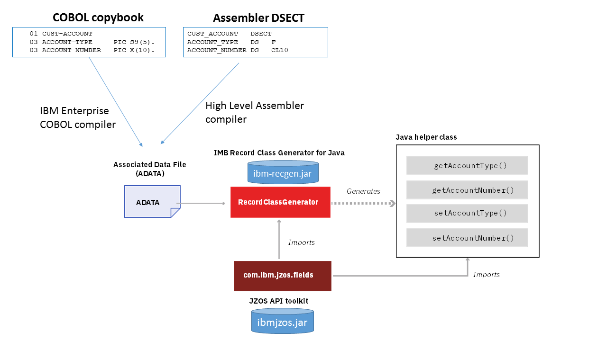
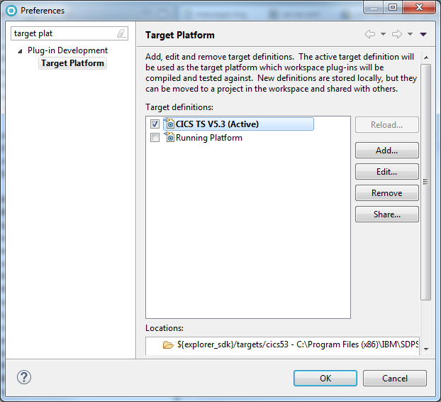
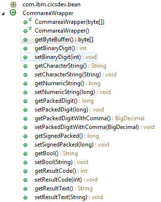
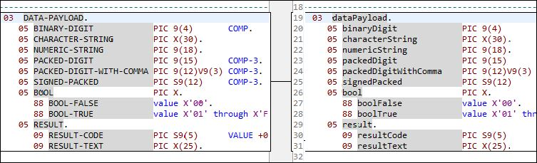

Building Java records from COBOL with the IBM Record Generator for Java
=======================================================================

Author: Phil Wakelinn

*When developing a Java program to link to a CICS COBOL program with a
COMMAREA or to access a VSAM file, you will typically need to map the
data fields from a record structure to specific Java datatypes. This
article describes a batch process to automate the generation of Java
helper classes from a COBOL copybook using the new IBM Record Generator
for Java V3.0 and then shows how to use the generated Java classes in a
CICS Java application.**

IBM Record Generator for Java
-----------------------------

The Record Generator is a scriptable Java based utility that takes as
input the ADATA from the COBOL compiler, and uses this to generate Java
helper classes to access the fields in a COBOL record structure. The
ADATA provides additional program data that can be used to extract
information about the program for symbolic debugging or cross-reference
tools. The Record Generator is based upon function in the IBM JZOS
Toolkit which provides [field converter
classes](https://www.ibm.com/support/knowledgecenter/en/SSYKE2_8.0.0/com.ibm.java.zsecurity.api.80.doc/com.ibm.jzos/com/ibm/jzos/fields/package-summary.html)
for mapping byte array fields into Java data types.



> **Note:** IBM Record Generator for Java V3.0 is a new [IBM program
> product](https://www.ibm.com/common/ssi/cgi-bin/ssialias?infotype=an&subtype=ca&supplier=897&letternum=ENUS217-295)
> generally available as of 29th Sept 2017 and supersedes the IBM
> alphaWorks version of the JZOS Record Generator V2.4.6, which is now
> withdrawn. The Record Generator for Java, V3.0, provides the following
> new and enhanced functions:
>
> -   Support for ADATA files with or without an IBM Record Descriptor
>     Word (RDW) prefix making it easier to transfer the ADATA files
>     from z/OS to distributed platforms.
> -   Support for a user-supplied, Java name generator class to control
>     the schema for generating accessor methods from field names
> -   Support to ignore OCCURS 1 on COBOL single element arrays, so that
>     fields are generated as an array of size 1
> -   Ability to set the string encoding during record generation
> -   A set of new generation options to optimize the generated code
> -   A new [IBM Knowledge
>     Center](https://www.ibm.com/support/knowledgecenter/SSMQ4D_3.0.0/documentation/welcome.html)
>
> The Record Generator for Java V3.0 is freely available to
> [download](https://ibm.github.io/mainframe-downloads/IBM-Record-Generator-for-Java.html)
> for all users of z/OS V2.1, or later. License redistribution rights
> are provided for deployment to non-z/OS platforms to support
> distributed development and build.

------------------------------------------------------------------------

The following steps will be covered in this article

1.  Setup of the environment
2.  Using the Record Generator to create a Java record wrapper class
    from a COBOL structure
3.  Development of a CICS Java program to use the record wrapper
4.  Deployment of the Java components into a CICS OSGi JVM server

 

### 1. Setup

First of all you will need to perform the following prerequisites.

-   Download the Record Generator zip archive from the [download
    site](https://ibm.github.io/mainframe-downloads/IBM-Record-Generator-for-Java.html)
-   Extract ibm-recgen.jar and transfer this to a directory on your zFS
    as this will be required by the batch job to generate records from
    the COBOL source.
-   Download the [EDUPGM](https://github.com/cicsdev/cics-java-jzosprog)
    CICS COBOL sample if you want to deploy the example from this
    tutorial.

 

### 2.1 Creating the COBOL build job

The first step in creating a record is to modify the compile process to
produce ADATA output. To produce the ADATA you simply need to add the
ADATA keyword to the COBOL PARM statement and then direct the output to
a pre-allocated SYSADATA dataset. This ADATA dataset will then be used
as input for the Java record generation in the next step.

Next, if required, link edit the load module for deployment into CICS.
The following JCL provides a sample COBOL V5.1 compile job with the
ADATA PARM option and SYSADATA DD, based on the sample in the CICS
translate and compile job DFHZITCL.

 

```cobol
    //ASMCOBJ JOB (H251620-TSOO),CLASS=A,MSGCLASS=T,NOTIFY=&SYSUID,
    // MSGLEVEL=(1,1),REGION=500M
    //  SET PROG='EDUPGM'                                               
    //COBOL  EXEC PGM=IGYCRCTL,REGION=200M,                               
    //            PARM=(NODYNAM,RENT,LIST,MAP,XREF,ADATA,                 
    //            'CICS(''SP,COBOL3'')')                                  
    //STEPLIB  DD DSN=PP.COBOL390.V510.SIGYCOMP,DISP=SHR                  
    //         DD DSN=CICSTS.530.SDFHLOAD,DISP=SHR         
    //SYSLIB   DD DSN=USER.CICS.DSECT,DISP=SHR                         
    //         DD DSN=USER.CICS.COPY,DISP=SHR                          
    //         DD DSN=CICSTS.530.SDFHCOB,DISP=SHR          
    //         DD DSN=CICSTS.530.SDFHMAC,DISP=SHR          
    //         DD DSN=CICSTS.530.SDFHSAMP,DISP=SHR         
    //SYSADATA DD DSN=USER.CICS.COBADATA(&PROG),DISP=SHR               
    //SYSPRINT DD SYSOUT=A                                                
    //SYSLIN   DD DSN=&&LOADSET,DISP=(MOD,PASS),                          
    //            UNIT=SYSDA,SPACE=(TRK,(3,3))                            
    //SYSUT1   DD UNIT=SYSDA,SPACE=(CYL,(1,1))                            
    //SYSUT2   DD UNIT=SYSDA,SPACE=(CYL,(1,1))                            
    //SYSUT3   DD UNIT=SYSDA,SPACE=(CYL,(1,1))                            
    //SYSUT4   DD UNIT=SYSDA,SPACE=(CYL,(1,1))                            
    //SYSUT5   DD UNIT=SYSDA,SPACE=(CYL,(1,1))                            
    //SYSUT6   DD UNIT=SYSDA,SPACE=(CYL,(1,1))                            
    //SYSUT7   DD UNIT=SYSDA,SPACE=(CYL,(1,1))                            
    //SYSUT8   DD UNIT=SYSDA,SPACE=(CYL,(1,1))                            
    //SYSUT9   DD UNIT=SYSDA,SPACE=(CYL,(1,1))                            
    //SYSUT10  DD UNIT=SYSDA,SPACE=(CYL,(1,1))                            
    //SYSUT11  DD UNIT=SYSDA,SPACE=(CYL,(1,1))                            
    //SYSUT12  DD UNIT=SYSDA,SPACE=(CYL,(1,1))                            
    //SYSUT13  DD UNIT=SYSDA,SPACE=(CYL,(1,1))                            
    //SYSUT14  DD UNIT=SYSDA,SPACE=(CYL,(1,1))                            
    //SYSUT15  DD UNIT=SYSDA,SPACE=(CYL,(1,1))                            
    //SYSMDECK DD UNIT=SYSDA,SPACE=(CYL,(1,1))                            
    //SYSIN    DD DSN=USER.CICS.SOURCE(&PROG),DISP=SHR           
    /*                                                                     
    //COPYLINK EXEC PGM=IEBGENER,COND=(7,LT,COBOL)                         
    //SYSUT1   DD DSN=CICSTS.530.SDFHSAMP(DFHEILID),DISP=SHR
    //SYSUT2   DD DSN=&&COPYLINK,DISP=(NEW,PASS),                          
    //            DCB=(LRECL=80,BLKSIZE=400,RECFM=FB),                     
    //            UNIT=SYSDA,SPACE=(400,(20,20))                           
    //SYSPRINT DD SYSOUT=A                                                 
    //SYSIN    DD DUMMY                                                    
    //*                                                                    
    //LKED   EXEC PGM=IEWL,REGION=200M,                                    
    //            PARM='LIST,XREF,RENT,MAP',COND=(7,LT,COBOL)              
    //SYSLIB   DD DSN=CICSTS.530.SDFHLOAD,DISP=SHR          
    //         DD DSN=PP.ADLE370.ZOS201.SCEELKED,DISP=SHR                  
    //SYSUT1   DD UNIT=SYSDA,DCB=BLKSIZE=1024,                             
    //            SPACE=(1024,(200,20))                                    
    //SYSPRINT DD SYSOUT=A                                                 
    //SYSLIN   DD DSN=&&COPYLINK,DISP=(OLD,DELETE)                         
    //         DD DSN=&&LOADSET,DISP=(OLD,DELETE)                          
    //         DD DDNAME=SYSIN                                             
    //SYSLMOD  DD DSN=USER.CICS70.LOADLIB,DISP=SHR                      
    //SYSIN    DD *                                                        
        NAME &PROG(R)                                                   
    /*                                                                    
```


### 2.2 Building the Java record

Now create a job step using BPXBATCH to invoke the Java
RecordClassGenerator utility class from the ibm-recgen.jar using the
ADATA as the input and naming the desired COBOL structure. In the
example below we used the ADATA in the input PDS
`USER.CICS.COBADATA `from step 2.1, and generated a record
`com.ibm.cicsdev.bean.JZOSCommareaWrapper.java`. This wrappers the
DFHCOMMAREA structure from our EDUPGM COBOL program. The inputs to the
job are parameterized to allow this to be scripted later.

> Migration from the JZOS Record Generator to the IBM Record Generator
> for Java V3.0 is simple and requires only that the new JAR file is
> used in place of jzos_recgen.jar and the new Java packages names
> com.ibm.recordgen.cobol and com.ibm.recordgen.asm are used in any
> scripts that drive the RecordClassGenerator utility.

```Shell   
    //RECGEN EXEC PGM=BPXBATCH      
    //STDENV   DD *               
    JAVAHOME=/java/java71_64/J7.1_64       
    PKG=com.ibm.cicsdev.bean               
    DIR=com/ibm/cicsdev/bean
    PROG=EDUPGM
    //STDOUT   DD   SYSOUT=*    
    //STDERR   DD   SYSOUT=*
    //STDPARM DD *                    
    sh cd /u/cics1/recgen;                                              
    $JAVAHOME/bin/java                                                    
      -cp ./ibm-recgen.jar                                              
      com.ibm.recordgen.cobol.RecordClassGenerator                   
      adataFile="//'USER.CICS.COBADATA(${PROG})'"                      
      symbol=DFHCOMMAREA                                                  
      outputDir=.                                                         
      package=${PKG}                                                      
      class=JZOSCommareaWrapper;
    /*                                                
```

### 2.3 Compile the Java record class

Lastly we need to build the Java record `JZOSCommareaWrapper.java`
created in step 2.2. This requires compiling using the javac compiler
and then packaging as a JAR for deployment using the Java supplied jar
utility. You can simply add the following statements to the end of the
BPXBATCH job step

```Shell
    $JAVAHOME/bin/javac ${DIR}/JZOSCommareaWrapper.java;                      
    $JAVAHOME/bin/jar -cvf ${PROG}.jar ${DIR}/JZOSCommareaWrapper.class;      
```
 

The job is now ready and can be used as part of a build system to easily
rebuild the record when any changes are made to the copybooks. The
record can be transferred to your scource code management system and
then downloaded for use in an Eclipse development environment to assist
with the marshaling of data when interacting with COBOL structures in a
COMMAREA or other sequential data records such as VSAM files.

## 3. Eclipse workstation development

CICS Java development is centered around the use of the CICS Explorer
SDK which helps you develop with OSGi. In an OSGi development
environment *Target Platform* definitions are used to define the plugins
that applications in the workspace will be built against.

### 3.1 Creating the Eclipse project

The first step is to create an Eclipse project. We will be using an OSGi
development environment so before we generate any code we will first
need to create a new OSGi Plug-in project in Eclipse using the wizard
**File -\> New -\> Plug-in Development -\> Plug-in Project** as shown on
the right. As you go through the wizard follow these steps:

1.  On the first panel of the Plug-in Project wizard, select the
    standard OSGi framework option as we do not need any extra Eclipse
    or Equinox extensions
2.  On the second panel make sure that the Version is set to 1.0.0
    without a qualifier as the OSGi JVM server does not support the use
    of qualifiers. Also ensure the selected Java execution environment
    is supported in your JVM server and that the option to generate an
    activator is not selected as this is not required
3.  On the third panel uncheck the box to create a plug-in using a
    template as we will add our own application code to the project.

### 3.2 Creating the Target Platform

The CICS Explorer SDK provides a set of sample Target Platforms which
provide the JCICS APIs for different CICS TS versions. The Target
Platform is set using the Eclipse menu **Windows -\> Preferences -\>
Plug-in Development -\> Target Platform**. Click **Add** and then from
the supplied templates select the CICS TS release for your runtime
environment, and click **Next** and then **Finish**. You can then select
this and apply this to your workspace, and this will allow you to use
the JCICS APIs in your application. For further details on the options
for defining OSGi package imports refer to this article [Configuring
OSGi package
imports](https://developer.ibm.com/cics/2016/01/29/java-for-cics-configuring-package-imports/)



### 3.3 Adding OSGI package imports

In addition to JCICS we also need to consider the Java packages used by
the generated records. These records rely on classes in the the
`com.ibm.jzos.fields` package which is provided with the IBM SDK for
Java on z/OS in ibmjzos.jar. If you just use the pre-built classes in
your application then OSGI package imports are not required when
compiling the application, however, they will be required at runtime in
the OSGI JVM server as all the dependencies need to be correctly wired
when the OSGI bundles are installed. To resolve this import there are 3
options:

1.  Wrapper the `ibmjzos.jar` as an OSGI bundle, export the required
    packages and add this OSGI bundle to your Eclipse workspace or
    target platform and then add an Import-Package statement for
    `com.ibm.jzos.fields` to the bundle manifest.
2.  Use a `resolution:=optional` Import-Package statement in the OSGi
    bundle manifest. This will allow the bundle to activate if the
    packages can't be located. This allows the code to be compiled and
    exported without the JZOS packages being available in the workspace,
    but will still allow the JZOS package dependency to be resolved in
    the JVM server when the bundle is installed. This is because the
    CICS OSGi JVM server adds the JZOS packages to the default list
    exported by the OSGI system bundle.
3.  If you are using CICS TS V5.3 or later, you can exploit the OSGi
    last resort boot delegation behaviour which will load classes from
    the JVM boot classpath if they fail to load from the bundle class
    loaders. This means you would not need to add an Import-Package
    statement unless you modify the default boot delegation behavior of
    the JVM server. For further details refer to [Configuring OSGi
    package
    imports](https://developer.ibm.com/cics/2016/01/29/java-for-cics-configuring-package-imports/)

We will use the optional import method (2) as we don't need to use any
other functions of JZOS other than the com.ibm.jzos.fields package and
it is good practice to ensure all dependencies are explicitly declared
in the bundle manifest.

Add the following `Import-Package` statements to the bundle manifest for
JCICS and JZOS. The JCICS import should be versioned to define the OSGi
semantic version referring to the supported [JCICS
API](http://www.ibm.com/support/knowledgecenter/SSGMCP_5.3.0/com.ibm.cics.ts.java.doc/topics/dfhpjlp.html?lang=en)
for instance `com.ibm.cics.server;version="[1.300.0,2.0.0)"`. However,
the JZOS package `com.ibm.jzos.fields` can be listed without a
referenced version.

You resulting manifest should now look something like the following:

```
    Manifest-Version: 1.0
    Bundle-ManifestVersion: 2
    Bundle-Name: com.ibm.cicsdev.jzostest
    Bundle-SymbolicName: com.ibm.cicsdev.jzostest
    Bundle-RequiredExecutionEnvironment: JavaSE-1.7
    Bundle-Version: 1.0.0
    Import-Package: com.ibm.cics.server;version="[1.300.0,2.0.0)",
     com.ibm.jzos.fields;resolution:=optional
```

 
### 3.4 Creating a CICS Java application

Now you are ready to create the Java application. As you will need to
use OSGi you first need to ensure the packages required are exported
from their corresponding OSGi bundles. We have already discussed access
to the JZOS packages in step 3.2, but the CommareaWrapper class was
built as an ordinary JAR. We can either create a wrapper project for
this to convert it into an OSGi bundle, or we can just add this JAR to
the OSGi bundle class path of our new application. We will use the later
method and add the JAR to the bundle classpath. This method will limit
usage of the CommareaWapper to components in the OSGi bundle we are
about to create, which is fine for our example.

Create a new OSGi bundle project in Eclipse using the wizard **File -\>
New -\> Other -\> Plug-in Project**. Next create a new Java package
**com.ibm.cicsdev.jzostest** and add a new class **JZOSprog**. Copy in
the code show below, which will make a `JCICS Program.link()` call to
our EDUPGM CICS COBOL program. Alternatively you can download the sample
code [here](https://github.com/cicsdev/cics-java-jzosprog)

```java
public class JZOSprog {

    public static String proglink = "EDUPGM";  // Linked to COBOL program

    public static void main(String[] args)          
    {

        // Get details about our current CICS task
        Task task = Task.getTask();
        task.out.println(" - Starting JOZSprog");

        // Wrapper objects for input and output commareas
        JZOSCommareaWrapper cwIn = null;
        JZOSCommareaWrapper cwOut = null;

        // Set the input data fields
        Short binarydigit = 1;
        String charstring = "hello";
        Short numericstring = 1234;
        Integer packeddigit = 123456789;
        Integer signedpackeddigit = -100;
        String bool = "1";

        cwIn = new JZOSCommareaWrapper();
        cwIn.setBinaryDigit(binarydigit );
        cwIn.setCharacterString(charstring );
        cwIn.setNumericString(numericstring );
        cwIn.setPackedDigit(packeddigit );
        cwIn.setSignedPacked(signedpackeddigit );
        cwIn.setBool(bool );

        // Create a reference to the CICS program
        Program prog = new Program();
        prog.setName(proglink);

        // Create byte array for input commarea from wrapper
        byte[] commarea = cwIn.getByteBuffer();

        try {
            // Link to target CICS program
            prog.link(commarea);

            //Create output record from updated commarea
            cwOut = new JZOSCommareaWrapper(commarea);

            // Catch any other exception and force a  rollback of CICS UOW
        } catch (Exception e) {
            String msg = "ERROR: Exception on link to {0} with msg({1})";
            task.out.println(MessageFormat.format(msg, proglink, e.getMessage()));
            // Rollback the CICS Task
            try
            {
                task.rollback();
            } catch (InvalidRequestException e1) {      
                // If this fails, then throw Runtime Exception
                throw new RuntimeException(e1);
            }
        }

        String msg = "Returned from {0} with rc({1}) {2}";
        task.out.println(MessageFormat.format(msg, proglink,cwOut.getResultCode(), cwOut.getResultText()));

    }

}
```

 

In this sample we use the setter methods from the generated
CommareaWrapper to access the individual fields in the record. Each
field in the COBOL record can be written to using methods such as
`setBinaryDigit()` and `setCharacterString()` and also read via
corresponding getters. The entire byte array representing the records
can be passed into a call using a Java `byte[]` array returned via the
`getByteBuffer()`.

 





When generating Java code from COBOL records it is helpful if you rename
the COBOL data fields in a Java fashion so that the generated code has a
naming convention that would be more familiar to a Java programming
style. The picture above shows an example of the renaming used in our
COBOL data structure and the the screen shot to the right shows the
outline view of the class with all the generated setters and getters for
the fields available in this record.

Next transfer the EDUPGM.jar containing the CommareWrapper record onto
the workstation. Create a new folder in the project called **lib**, and
then drag the JAR into this folder in your Eclipse project. Then from
the OSGi bundle manifest editor add this JAR to the OSGI bundle
classpath using the menu **Runtime -\> Classpath -\> Add**. This will
add the following statement to the manifest.

```
    Bundle-ClassPath: lib/EDUPGM.jar,
     .
```


Also update the Build tab in the manifest editor to add the lib
directory to the Binary Build to ensure the EDUPGM.jar gets added to the
build output.

Finally add a `CICS-MainClass:` definition to the bundle manifest to
register a MainClass service for our `com.ibm.cicsdev.jzostest.JZOSprog`
class. This will allow the Java class to be LINKed to using a CICS
program definition. Your manifest should now look similar to this

```
    Manifest-Version: 1.0
    Bundle-ManifestVersion: 2
    Bundle-Name: com.ibm.cicsdev.jzostest
    Bundle-SymbolicName: com.ibm.cicsdev.jzostest
    Bundle-RequiredExecutionEnvironment: JavaSE-1.7
    Bundle-Version: 1.0.0
    Import-Package: com.ibm.cics.server;version="[1.300.0,2.0.0)",
     com.ibm.jzos.fields;resolution:=optional
    Bundle-ClassPath: lib/EDUPGM.jar,
     .
    CICS-MainClass: com.ibm.cicsdev.jzostest.JZOSprog
```
 

### 4. Testing the application

The application is now ready to be tested, and can simply be deployed
into a CICS OSGi JVM server using a CICS Bundle project as follows:

1.  Create a CICS bundle project in Eclipse and add the OSGi bundle
    project using the menu **New -\> OSGi Bundle Project Include**
1.  Deploy to zFS using the menu **Export Bundle Project to z/OS UNIX
    File System**
1.  Create a CICS BUNDLE definition referencing this zFS location and
     install this
1.  Create a CICS PROGRAM definition for the Java application called
    JZOSPROG. This should name the CICS-MainClass:
    `com.ibm.cicsdev.jzostest.JZOSprog` in the JVMClass attribute
1.  Optionally create a PROGRAM definition for the COBOL EDUPGM if you
    are not using program autoinstall
1. Create a transaction definition referencing the JZOSPROG program
    definition if this is to be run from a 3270 terminal
1. Install the program and transaction definitions

When invoked our Java class JZOSprog will link to the COBOL EDUPGM using
the CommareaWrapper classes to marshall the input to the required COBOL
record formats. It should return the following messages if successful
indicating the input and output CommareaWrapper records have been
successfully used to marshall the data in the COMMAREA.

    Starting JZOSprog
    Returned from EDUPGM with rc(0) PARAMETERS ARE ALL OK

 

------------------------------------------------------------------------

 

References
----------

-   IBM Record Generator - [Download](https://ibm.github.io/mainframe-downloads/IBM-Record-Generator-for-Java.html)
-   Sample code available in the
    [cics-java-recgen](https://github.com/cicsdev/cics-java-recgen) Git
    repository
-   JZOS for z/OS SDKs -
    [Cookbook](https://www.ibm.com/marketing/iwm/iwm/web/reg/download.do?source=zossdkcookbook&S_PKG=dl)
-   IBM Knowledge Center -- [IBM Record Generator for Java
    V3.0.0](https://www.ibm.com/support/knowledgecenter/SSMQ4D_3.0.0/documentation/welcome.html)
-   IBM Redbook - [Java Stand-alone Applications on z/OS Volume
    II](http://www.redbooks.ibm.com/abstracts/sg247291.html)
-   JZOS API Toolkit -
    [Javadoc](https://www.ibm.com/support/knowledgecenter/en/SSYKE2_8.0.0/com.ibm.java.zsecurity.api.80.doc/com.ibm.jzos/overview-summary.html)
-   Requests for Enhancements - [RFE
    Community](https://www.ibm.com/developerworks/rfe/execute?use_case=changeRequestLanding&BRAND_ID=352&PROD_ID=1716)

**Note:** An alternative data marshaling solution to IBM Record
Generator for Java is the Rational J2C Tools which are described further
in this tutorial [Generating Java Records from COBOL with Rational J2C](https://github.com/cicsdev/cics-java-j2cprog/blob/master/blog.md).

------------------------------------------------------------------------

Change history
--------------

- 27/June/16 -- Updated to reflect renaming of CommareaWrapper in sample
- 26/July/16 -- Updated to reference J2C article
- 08/Sept/16 -- Updated to use optional dependency resolution for JZOS
- 07/June/17 -- Added details on creating Eclipse project and setting build.properties
- 21/June/17 -- Corrected references to J2C
- 01/Aug/17 -- Clarified program definitions
- 29/Sept/17 -- Updated for launch of IBM Record Generator for Java V3.0
- 16/Oct/17 -- Updated repo name
- 12/Aug/20 -- Migrated blog to GitHub
- 17/Aug/20 -- Update download links
- 27/Nov/20 -- Move J2C tutorial to its own repo